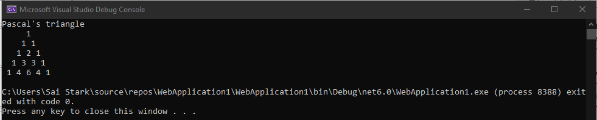

# Pattern

## Aim:
To write a C# program to draw a pattern.
## Algorithm:
### Step 1:
Create a class and declare a variable with string datatype
### Step 2:
Use for loop to check whether the input is a palindrome or not.
### Step 3:
Use if condition to check whether input is equal to the calculated number.
### Step 4:
Display the results of the condition of the input using Console.WriteLine().
## Program:
```
using System;
namespace PascalTriangleDemo
{
    class Example
    {
        public static void Main()
        {
            int rows = 5, val = 1, blank, i, j;
            Console.WriteLine("Pascal's triangle");
            for (i = 0; i < rows; i++)
            {
                for (blank = 1; blank <= rows - i; blank++)
                    Console.Write(" ");
                for (j = 0; j <= i; j++)
                {
                    if (j == 0 || i == 0)
                        val = 1;
                    else
                        val = val * (i - j + 1) / j;
                    Console.Write(val + " ");
                }
                Console.WriteLine();
            }
        }
    }
}
```
## Output:

## Result:
Thus the C# program to display the given pattern is executed successfully.
